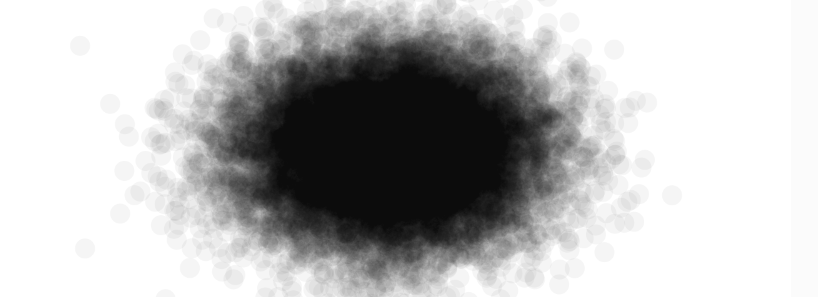
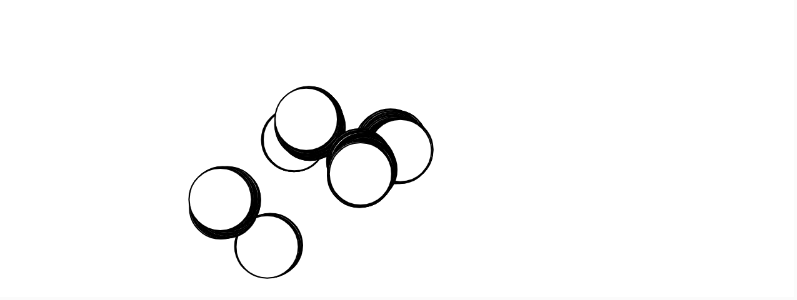
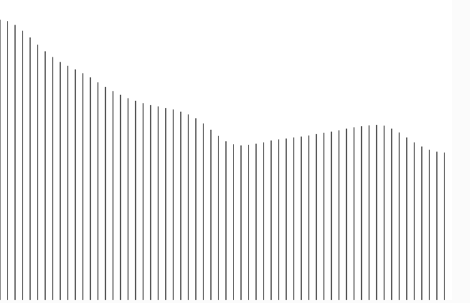
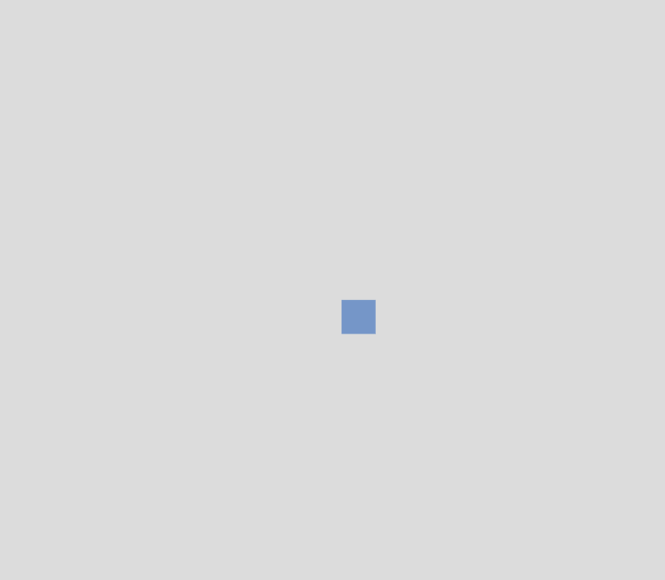

# Unidad 1

## Bitácora de proceso de aprendizaje
### Actividad 1
La aleatoriedad en el arte generativo actúa como una chispa de imprevisibilidad que rompe el control total del creador y permite que emerjan formas, patrones y significados inesperados que hacen cada obra única.
### Actividad 2 
``` js
// The Nature of Code
// Daniel Shiffman
// http://natureofcode.com

let walker;
let num;

function setup() {
  createCanvas(640, 240);
  walker = new Walker(); //Guarda la direccion del objeti tipo waker creando una nueva funcion
  background(255);
  num = floor(random(2));
}

function draw() {
  walker.step();
  walker.show();
}

class Walker {
  constructor() {
    this.x = width / 2;
    this.y = height / 2;
  }

  show() {
    if (num == 0) {
    stroke(0);
    point(this.x, this.y);
    }else if (num == 1) {
   stroke(0);
  circle(this.x, this.y, 50);
    }
  }

  step() {
    const choice = floor(random(4));
    if (choice == 0) {
      this.x++;
    } else if (choice == 1) {
      this.x--;
    } else if (choice == 2) {
      this.y++;
    } else {
      this.y--;
    }
  }
}
```

espero que salga un circulo ya que tiene un 50% de probabilidad de salir. Efectivamente despues de probar salio el circulo. Lo essperaba ya que tiene una probabilidad de la mitad. 

### Actividad 3
Una distribucion uniforme es dodne los valores tienen la msima distancia unos de otros y no hay una variacion entre ellos; mientras que una no uniforme permite mas disprecion de datos. 
``` js
// The Nature of Code
// Daniel Shiffman
// http://natureofcode.com

let walker;
let num;

function setup() {
  createCanvas(640, 240);
  walker = new Walker(); //Guarda la direccion del objeti tipo waker creando una nueva funcion
  background(255);
  num = floor(random(2));
}

function draw() {
  walker.step();
  walker.show();
}

class Walker {
  constructor() {
    this.x = width / 2;
    this.y = height / 2;
  }

  show() {
    if (num == 0) {
    stroke(0);
    point(this.x, this.y);
    }else if (num == 1) {
   stroke(0);
  circle(this.x, this.y, 50);
    }
  }

  step() {
    const choice = floor(random(4));
    if (choice == 0) {
      this.x++;
    } else if (choice == 1) {
      this.x++;
    } else if (choice == 2) {
      this.y++;
    } else {
      this.y--;
    }
  }
}
```

### Actividad 4 

``` js
function setup() {
  createCanvas(640, 240);
  background(255);
}

function draw() {
  //{!1} A normal distribution with mean 320 and standard deviation 60
  let x = randomGaussian(320, 60);
  let y = randomGaussian(120, 40);
  noStroke();
  fill(0, 10);
  circle(x, y, 16);
```

[Archivo p5.js](https://editor.p5js.org/simonburgosb/sketches/BeVWAln3C)



### Actividad 5 
Use esta tecnica para hacer como un salto de movimiento
``` js
// The Nature of Code
// Daniel Shiffman
// http://natureofcode.com

let walker;
let num;

function setup() {
  createCanvas(640, 240);
  walker = new Walker(); //Guarda la direccion del objeti tipo waker creando una nueva funcion
  background(255);
  num = floor(random(2));
}

function draw() {
  walker.step();
  walker.show();
}

class Walker {
  constructor() {
    this.x = width/2 ;
    this.y = height/2 ;
  }

  show() {
    if (num == 0) {
    stroke(0);
    point(this.x, this.y);
    }else if (num == 1) {
   stroke(0);
  circle(this.x, this.y, 50);
    }
  }

  step() {
    let r = random(1);
    let xStep;
    let yStep;
//{!3} A 1% chance of taking a large step
if (r < 0.01) {
  xStep = random(-100, 100);
  yStep = random(-100, 100);
} else {
  xStep = random(-1, 1);
  yStep = random(-1, 1);
}
    
    this.x += xStep;
    this.y += yStep
  }
}

```

[Archivo p5.js](https://editor.p5js.org/simonburgosb/sketches/UJ_XaLKmO)


### Actividad 6

Espero que cuando incie el programa pase que durante el ancho de la pantalla se vaya proyectando el ruido de perlin en forma de grafico
``` js
let xoff = 0;

function setup() {
  createCanvas(600, 400);
  background(255);
}

function draw() {
  stroke(0);

  let x = 0;
  xoff = 0;

  while (x < width) {
    let y = noise(xoff) * height;
    line(x, height, x, height - y);

    xoff += 0.02;
    x += 10;
  }
}


```
([https://editor.p5js.org/simonburgosb/sketches/otxT05gaM])

## Bitácora de aplicación 
Este diseño genera una composición interactiva donde, al hacer clic, se selecciona aleatoriamente una forma geométrica y esta se dibuja repetidamente en posiciones que varían según una distribución normal, haciendo que la mayoría de las apariciones se concentren cerca del centro del lienzo; al mismo tiempo, el color de relleno cambia de manera suave usando ruido Perlin

``` js
let particula;
let f;

function setup() {
  createCanvas(600, 600);
  particula = new Particula();
}

function draw() {
  background(220);

  particula.forma = f;
  particula.move();
  particula.form();
}

function mousePressed() {
  f = int(random(1, 4));
}

class Particula {
  constructor() {
    // centro base
    this.cx = width / 2;
    this.cy = height / 2;

    this.x = this.cx;
    this.y = this.cy;

    this.tc = random(1000); // noise para color
    this.forma = 1;
  }

  move() {
    // movimiento con distribución normal
    this.x = randomGaussian(this.cx, 20);
    this.y = randomGaussian(this.cy, 20);
  }

  form() {
    // fill controlado por noise
    let c = noise(this.tc) * 255;
    fill(c, 150, 200);
    noStroke();
    this.tc += 0.01;

    if (this.forma === 1) {
      circle(this.x, this.y, 30);
    } 
    else if (this.forma === 2) {
      rect(this.x, this.y, 30, 30);
    } 
    else if (this.forma === 3) {
      triangle(
        this.x, this.y - 15,
        this.x - 15, this.y + 15,
        this.x + 15, this.y + 15
      );
    }
  }
}

```
([https://editor.p5js.org/simonburgosb/sketches/O_0apqmVL])



## Bitácora de reflexión


